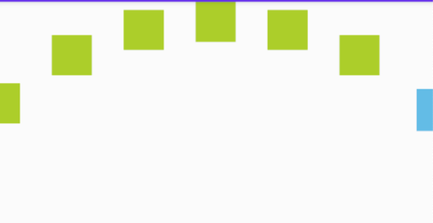
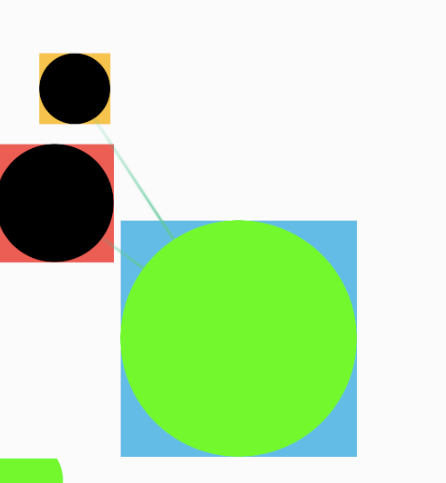
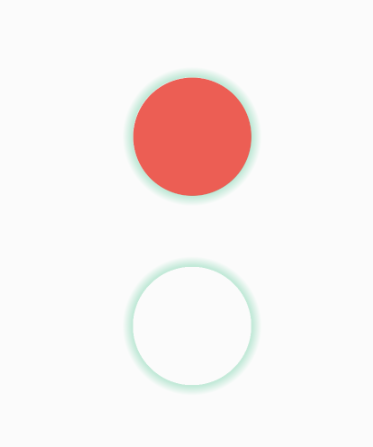

# UI 组件库

## ArcLayout

子 View 呈圆弧排列的布局



**布局**

- radius: 绝对半径
- radiusRatioBasedOnWidth: 相对于 View 宽度的半径, 优先于 radius
- span: 子 View 间距

```xml

<com.antiless.support.design.arclayout.ArcLayout android:id="@+id/arcLayout" android:layout_width="match_parent"
    app:radius="100dp" app:radiusRatioBasedOnWidth="0.8" app:span="100dp" android:layout_height="300dp"
    android:animateLayoutChanges="true" app:layout_constraintTop_toTopOf="parent">

    <View android:id="@+id/rawArc" android:layout_width="40dp" android:layout_height="40dp"
        android:background="@android:color/holo_blue_light"/>
</com.antiless.support.design.arclayout.ArcLayout>
```

**代码**

```kotlin
// 添加子项
arcLayout.addItem(view)

// 删除子项
arcLayout.removeItem(view)

// 滚动到指定位置
arcLayout.setCurrentItem(index)

// 获取当前位置
arcLayout.getCurrentItem()

// 添加滚动监听
arcLayout.addScrollChangeListener(object : ArcLayout.OnScrollChangeListener {

    override fun onScrollOffsetChanged(oldIndex: Int, oldOffset: Float, newIndex: Int, newOffset: Float) {
        // skip
    }

    override fun onScrollStateChanged(oldState: ArcLayout.ScrollState, newState: ArcLayout.ScrollState) {
        // skip
    }
})
```

## RayDrawable

射线动画 Drawable
可添加 View -> View 的射线动画



```kotlin
// 初始化
val drawable = Drawable(rayBitmap)
drawable.addRay(fromCircle, toCircle)
drawable.addRayForView(fromView, toView)

// 应用到具体场景
imageView.setImageDrawable(drawable)

// 添加到 overlay
contentView.overlay.addDrawable(drawable)

// 回收
drawable.destroy()
```

## RayAnimLayout
承载射线动画的布局
封装了使用 RayDrawable 相关的业务，把 RayAnimLayout 包裹在顶层使用即可

```xml
<?xml version="1.0" encoding="utf-8"?>
<com.antiless.support.design.raylayout.RayAnimLayout
    android:id="@+id/rayLayout"
    android:layout_width="match_parent"
    android:layout_height="match_parent">

    <androidx.constraintlayout.widget.ConstraintLayout
        android:layout_width="match_parent"
        android:layout_height="match_parent">

        <View
            android:id="@+id/yellow"
            android:layout_width="60dp"
            android:layout_height="60dp"
            android:layout_marginStart="12dp"
            android:layout_marginTop="60dp"
            android:background="@android:color/holo_orange_light"
            app:layout_constraintStart_toStartOf="parent"
            app:layout_constraintTop_toTopOf="parent"/>

        <FrameLayout
            android:layout_width="match_parent"
            android:layout_height="wrap_content"
            android:layout_marginTop="100dp"
            app:layout_constraintTop_toTopOf="parent">

            <View
                android:id="@+id/red"
                android:layout_width="100dp"
                android:layout_height="100dp"
                android:layout_gravity="bottom"
                android:layout_marginTop="60dp"
                android:background="@android:color/holo_red_light"
                app:layout_constraintEnd_toEndOf="parent"
                app:layout_constraintStart_toStartOf="parent"
                app:layout_constraintTop_toTopOf="parent"/>
        </FrameLayout>

        <View
            android:id="@+id/blue"
            android:layout_width="200dp"
            android:layout_height="200dp"
            android:background="@android:color/holo_blue_light"
            app:layout_constraintBottom_toBottomOf="parent"
            app:layout_constraintEnd_toEndOf="parent"
            app:layout_constraintStart_toStartOf="parent"
            app:layout_constraintTop_toTopOf="parent"/>

        <ImageView
            android:id="@+id/image"
            android:layout_width="200dp"
            android:layout_height="200dp"
            app:layout_constraintBottom_toBottomOf="parent"
            app:layout_constraintStart_toStartOf="parent"/>

    </androidx.constraintlayout.widget.ConstraintLayout>
</com.antiless.support.design.raylayout.RayAnimLayout>
```

**代码**
```kotlin
// 设置射线图片
rayLayout.rayBitmap = rayBitmap
// 或
rayLayout.setRayResource(rayResId)

// 添加射线 View
rayLayout.addRay(fromView, toView).apply {
    // 动画时间
    duration = 300
    // 动画结束后是否保留
    isPersistent = true
    // 动画完成后回调
    // 显示心率心形，显示设备发光
    doOnEnd {
        // show your heart
    }
    // 开始动画
    start()
}
```

## GlowDrawable
发光 Drawable



**用法**
可直接设置到 View 的 foreground 上，半径默认使用宽度的一半，只可用在正方形 View 上

```kotlin
// 构造参数
// borderColor - 边框颜色
// glowColor - 发光色
// borderWidth - 边框宽度
// glowWidth - 发光宽度
class GlowDrawable(val borderColor: Int, val glowColor: Int, val borderWidth: Int = 3, val glowWidth: Int = 20)

// 设置
view.foreground = glowDrawable()
```
> 需要在使用该 drawable 的 View 的父布局上设置 `android:clipChildren="false"`

## GlowView
包装了 GlowDrawable
直接作为普通 View 使用，宽高和需要装饰的 View 相同，发光体会自动溢出到 View 外面

> 需要在包裹了 GlowView 的布局上设置 `android:clipChildren="false"`

## 旋转动画
中间大圆圈的三张图，分上中下三层，直接作为 topView/middleView/bottomView 传入这个方法即可
```kotlin
fun applyThreeBodyAnimation(topView: View, middleView: View, bottomView: View)
```
